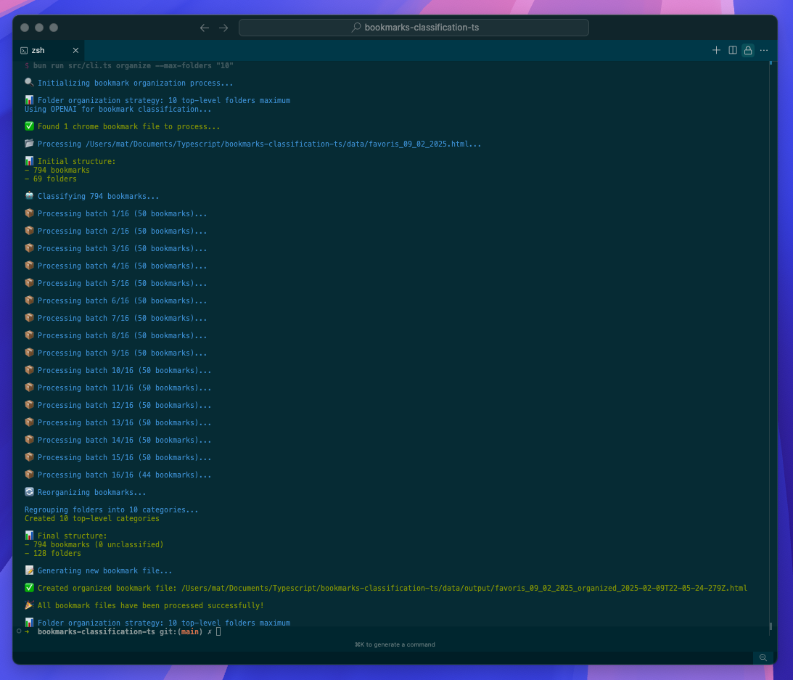

# Bookmark Organizer 📌

Automatically organize and classify your browser bookmarks using AI.



## Features

- Supports Chrome and Firefox bookmarks
- Multiple AI models supported (OpenAI and DeepSeek)
- Automatically creates meaningful folder structures
- Optional folder grouping to limit the number of top-level folders
- Adds relevant tags to bookmarks

## Installation

```bash
# Clone the repository
git clone [repo-url]
cd bookmarks-classification-ts

# Install dependencies
bun install
```

## Usage

1. Export your bookmarks from Chrome or Firefox as HTML
2. Place the exported HTML file(s) in the `data` folder
3. Run the organizer using one of these methods:

```bash
# Using environment variable
export AI_API_KEY='your-api-key'
export AI_MODEL='openai'  # or 'deepseek'
bun run organize

# Or directly with the command
bun run organize --api-key 'your-api-key' --model openai

# Specify browser (chrome is default)
bun run organize --browser firefox --model deepseek

# Limit the number of top-level folders (will group similar folders together)
bun run organize --max-folders 10

# Use all options
bun run organize --api-key 'your-api-key' --model openai --browser chrome --max-folders 15
```

The organized bookmarks will be saved in `data/output` with a timestamp in the filename.

## Requirements

- Bun runtime
- API key (OpenAI or DeepSeek)
- Chrome or Firefox bookmarks exported as HTML

## Supported AI Models

- OpenAI (GPT-3.5-turbo)
- DeepSeek (deepseek-chat)
